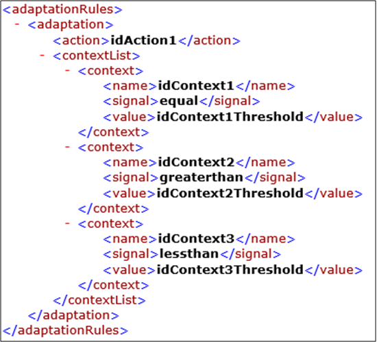
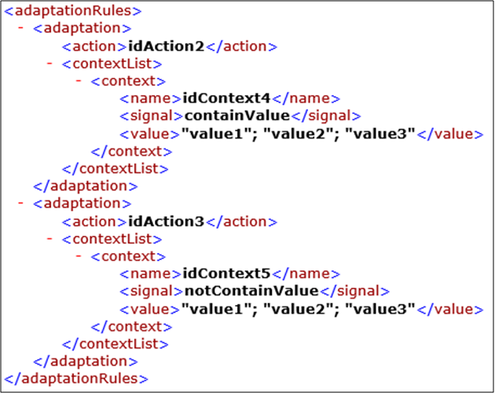

# Template de Regras de Adaptação

O objetivo desse template é fornecer um mecanismo que permita auxiliar a representação das regras de adaptação com base em um mecanismo simples de inferência, que verifica, dado um valor de contexto, ou um conjunto de valores de contexto identificados, se uma ação específica deve ser tomada.  Porém, é importante destacar que o template não indica como as ações, ou planos de ações, devem ser executados, mas apenas prover um meio de auxiliar a identificação de que ação, ou plano de ação, deve ser executado, considerando cada regra especificada. A versão atual do template utiliza arquivos em formatos ".xml", que podem ser compartilhados e editados enquanto a aplicação está em execução. 

A versão atual do template pode ser visto [aqui](./template.xml) contemplando os elementos usados para sua manipulação. O arquivo contém uma lista de regras de adaptações <adaptationRules>. Para cada adaptação <adaptation> existe uma ação ou plano de ação <action> e uma lista de contextos a serem verificados <contextList>. Para cada contexto em um lista <context> existe um identificador do contexto <name>, um sinal <signal>, que identifica o tipo de verificação a ser feita no contexto, e o valor limiar <value>, ou lista de valores, que o contexto deve assumir para que adaptação seja executada.
  

  
  
Figura 1. Template de regras de adaptação apenas com contextos numéricos

  
  
Os tipos de contextos verificados podem ser numéricos (Figura 1) ou strings (Figura 2). No caso de contextos numéricos a verificação identifica se o valor do contexto analisado (por exemplo, o nível de bateria, ou o valor de uma <i>feature</i> de movimentação) é "igual a" (valor de sinal <i>equal</i>), "maior que" (valor de sinal <i>greaterthan</i>), ou "menor que" (valor de sinal \textit{lessthan}), ao valor limiar especificado. Já no caso de contextos string, os tipos de contextos verificados estão relacionados a valores específicos "contidos" (valor de sinal <i>containValue</i>) ou "não contidos" (valor de sinal <i>notContainValue</i>) na lista de valores especificados. 

  
  
  
 Figura 2. Template de regras de adaptação apenas com contextos string 

  
Esse artefato pode ser usado para auxiliar as atividades de Criação das regras de Adaptação, Projeto com reúso e Desenvolvimento presente no processo proposto.
