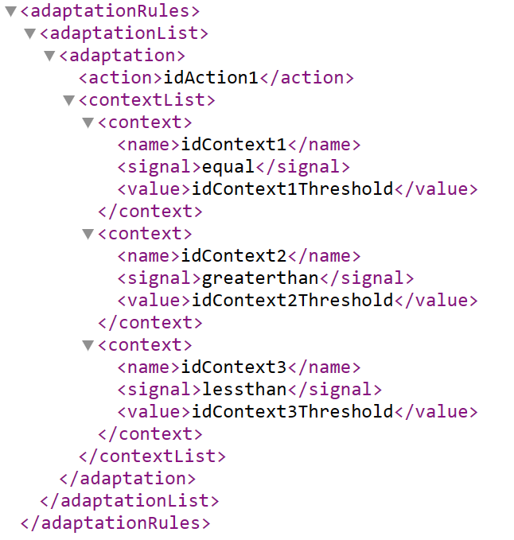
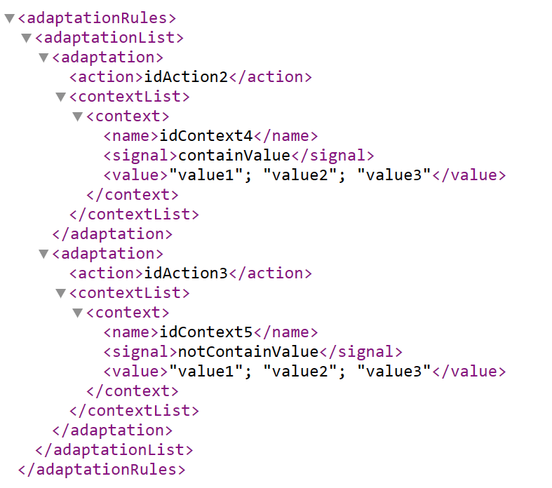

# About this API

This API was created to provide a set of adaptation rules for a mobile application that adjusts according to the device's battery level. The file containing the adaptation rules is available in the download folder and follows our proposed adaptation rules template, that is described below.

## ART - Adaptation Rules Template

The purpose of this template is to provide a mechanism that enables the representation of adaptation rules based on a simple inference mechanism, which verifies, given a context value or a set of identified context values, whether a specific action should be taken. However, it is important to note that the template does not indicate how actions or action plans should be executed, but only provides a means to assist in identifying which action or action plan should be executed, considering each specified rule. The current version of the template uses files in ".xml" formats, which can be shared and edited while the application is running.

The current version of the template can be viewed [here](./template.xml), which includes the elements used for its manipulation. The file contains a list of adaptation rules <adaptationRules>. For each adaptation <adaptation>, there is an action or action plan <action> and a list of contexts to be verified <contextList>. For each context in a list <context>, there is a context identifier <name>, a signal <signal> that identifies the type of context verification to be performed, and the threshold value <value>, or list of values, that the context must assume for the adaptation to be executed.
  

  
  
Figure 1. Adaptation rules template with numerical contexts only

  
  
The types of verified contexts can be numeric (Figure 1) or strings (Figure 2). In the case of numeric contexts, the verification identifies whether the value of the analyzed context (for example, the battery level or the value of a movement feature) is "equal to" (signal value <i>equal</i>), "greater than" (signal value <i>greaterthan</i>), or "less than" (signal value <i>lessthan</i>) the specified threshold value. In the case of string contexts, the types of verified contexts are related to specific values that are either "contained" (signal value <i>containValue</i>) or "not contained" (signal value <i>notContainValue</i>) in the specified list of values. 

  
  
  
 Figure 2. Adaptation rules template with string contexts only 

  
This artifact can be used to assist the activities of Adaptation Rule Creation, Reuse Design, and Implementation of the Development process.
