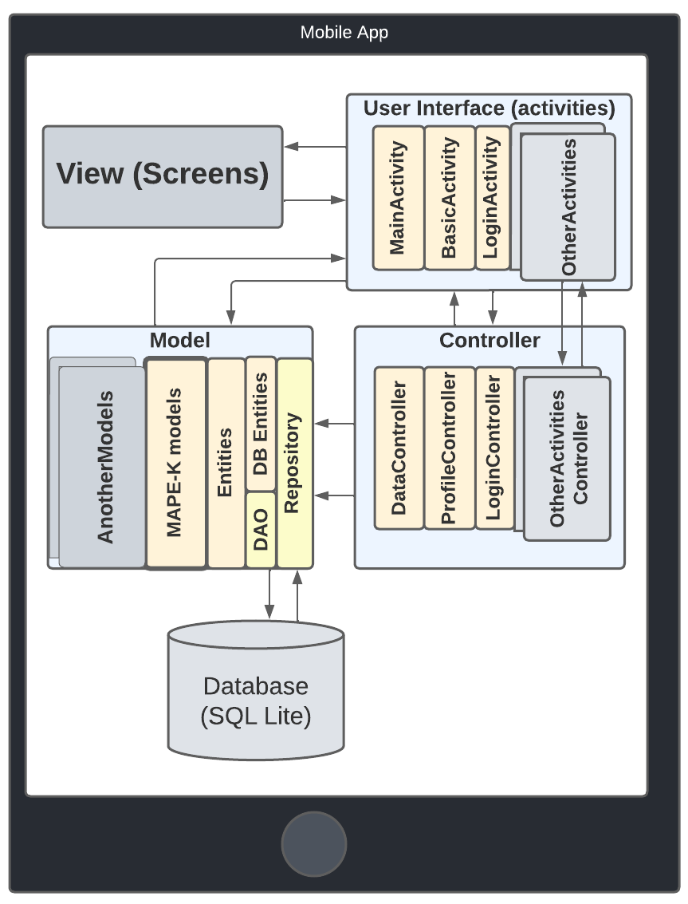

# Framework Kotlin (for Assist Motion Process)

# Descrição Geral

*Visão Geral*

[Diagrama de Classes](https://drive.google.com/file/d/1-QNAw4qUGligPNhtXTZ_DeecIpvcVMOX/view?usp=sharing)

## Sistemas IoHT baseados em padrões de movimento 

## Sistemas Auto Adaptivos

Os sistemas auto-adaptativos são capazes de monitorar e ajustar seu próprio comportamento em resposta às mudanças nas condições do ambiente, com o objetivo de melhorar sua eficiência e eficácia.

### Ciclo MAPE-K

O ciclo MAPE-K permite modelar o clico da adpatação e gerenciar a execução e as adaptações em sistemas auto-adaptativos. Ele permite que o sistema monitore e ajuste seu próprio comportamento em resposta a mudanças nas condições do ambiente.  O modelo consiste nas seguintes fases:

- Monitoramento 

Nessa etapa, o sistema monitora seu próprio comportamento e as condições do ambiente. Ele coleta dados e informações relevantes que serão analisadas para identificar o comportamento e possíveis mudanças que permitam planejar a execução da aplicação e possíveis adaptações, caso necessário.

- Análise

Nessa etapa, o sistema analisa os dados coletados na fase de Monitoramento para identificar padrões e resultados que permitam auxiliar o planejamento de ações, oportunidades de melhoria e possíveis adaptações necessárias. 

- Planejamento

Nessa etapa, com base na análise dos dados, o plano de ações que devem ser executadas pelo sitema é gerado. O plano pode incluir adaptações que modifiquem a maneira como o sistemas executa suas ações ou como desempenha tarefas internas ao sistema.

- Execução

Nesta fase, as ações planejadas são executadas pela aplicação. A execução deve ser cuidadosamente monitorada para garantir que as adaptações produzam os resultados esperados.

- Conhecimento (Knowledge)

Todas as etapas acima do ciclo podem ser assitidas por uma base de conhecimento que auxilie a tomada de decisões nas diversas fases do ciclo. Essa fase de conhecimento pode ser criada anteriomente a execução da aplicação. Ou criada a medida que a aplicação executa, com a possível adição de novas informações nessa base a cada ciclo.

## Grafo de classificação

# Manual de Uso

## First Steps

Uma vez feito o download do framework juntamente com todos os elementos e códigos que serão usados para auxiliar na construção de sua aplicação também é disponibilizada uma aplicação exemplo. Então você pode executá-la para verificar as fucnioalidade bases dos framework.  Recomendamos a princípio alterar nas "Strings" em "res/values/strings.xml" o nome do App para o nome que desejar. Além disso, outras informações também podém ser alteradas no string.xml

### Constants

Para cada aplicação uma série de valores constantes deve ser utilizado.  Então a princípio é importante que esse valores sejam alterados para sua aplicação específica. Verifique então o arquivo Constants.kt em "models/utils/Constants.kt". As constantes que devem ser alteradas obrigaotriamente são o email do administrador da aplicação, o endereço do servidor onde está hospedada a API de acesso ao grafo de classificação, caso queira o utilizar como base de conhecimento na constante "BACKEND_IP_PORT" e também, caso haja,  o endereço do servidor onde está hospedada a API de acesso ao template de regras de adaptação na constante "BACKEND_IP_PORT_ADAPTATION_RULES". As demais constantes são opcionais e devm ser alteradas apenas se for necessário de acordo com aplicação  ser desenvolvida. Você também pode, caso deseje,  adicionar outras contantes nesse arquivo Constants.kt.

### Autentificação para uso das APIs do Google

Esse framework disponibiliza suporte ao de uso de pelo menos uma da Google, o  que não impede que o desenvolvedor use outras APIs. Para utilizar essas APIS é obrigado criar uma chave/credencial Auth 2.0 em seua conta de desenvolvedor no Google Cloud (mesmo que não utiliza outros recursos da nuvem da Google). Para criar sua credencial Auth 2.0 recomendadmos seguir os passos da própria documentação oferecida pelo google, que pode ser acessada em: [https://developers.google.com/fit/android/get-api-key](https://developers.google.com/fit/android/get-api-key)

## Separação em Comentários

Ao longo das classes e outros objetos do framework há uma série de trechos de código que devem ou não ser alterados. Separamos quatro identificadores padrões para auxiliar na hosra de identificar o que não deve ser alterado (<b>//------Generated by the Framework and must not be changed-----//</b>), o que deve ser alterado para cada aplicação (<b>//------Generated by the Framework and must be changed-----//</b>), o que pode ser alterado, mas também pode ser mantido como está (<b>//------Generated by the Framework and can be changed-----//</b>) e o que é código do desenvolvedor da aplicação, então pode ser removido do exemplo e adicionado novo (<b>//------Generated by the User-----//</b>). 

Nesse último caso, sugerimos ao usuário do framework utilizar o comentário <b>//------Generated by the User-----//</b> com o nome ou nickname do desenvolvedor nos trechos novos que criar para facilitar a identificação e documentação do código criados exclusivamente pelo desenvolvedor. Assim é possível manter o código mais legível e serpar os trechos de código criados pelo desenvolvedor dos trechos alterados de acordo com o que consta no Framework. Além disso,  apesar de haver trechos com a maração <b>//------Generated by the Framework and must not be changed-----//</b>, nada impede que o desenvolvedor altere esses trechos, uma vez que o framework é de código aberto, mas é sugerido que esses trechos sejam mantidos para o uso das das vantagens de reúso e boas práticas de codificação fornecidas com o framework.

## Elementos do Framework e Padrões de Software

As classes e outros componentes do framework estão estruturados em uma série de pacotes seguindo o parão arquitetural Model-View-Controller com algumas adaptações. Todos os componentes visuais, incluindo as telas do app, como é padrão de aplicações android nativas estão no pacote <b> res </b>, sendo os componentes presentes nas pastas "layout", "navegation" e "values" os principais. Os "layouts", que correspondem as telas são dividios em Activities e Fragments e cada layout Activity e Fragment está ligada a uma classe Activitie ou Fragment presente no pacote <b> User Interface (ui) </b>. Os contoladores presentes no pacote <b> controllers </b> são usados para controle de informações relacionadas as activities.  Algumas actvities podem não ter contollers associados, caso o desenvolvedor não veja necessidade de tal. Além disso, por padrão disponibilizamos algumas classes controladoras (DataController, ProfileController e AppsExternalParametersController) que não são diretamente associadas a uma activities específicas, mas que contém elementos de controle úteis que podem ser associadas a uma ou mais activities para faciliatar o controle de dados do GoogleFit (DataController), do perfil da conta google (ProfileController) ou a disponibilização de novas releases do app ( AppsExternalParametersController). Finalmente o pacote <b> models </b> contém as classes relacionadas a conexão com APIs disponíveis em servidores na nuvem (pasta cloudConnection), ao processamento e manipulação de dados (pasta dao) e entidades (pasta entities), aos elementos do ciclo de adaptação MAPE-K (pasta mapek) e as classes e objetos úteis que contém métodos e constantes que podem ser usados por diferentes classes (pasta utils). 

### Padrão MVC

### Padrão Observer

### SUCCEED

### Coding and Reuse - Classes, Interfaces and Objects

A seguir detalhamos as classes e que trechos delas devem, ou não, ser alterados. Também apresentamos informações sobre quais novos elementos o desenvolvedor pode reusar e quais outros deve criar para usar o framework proposto como base para construir sua aplicação. Para ver os detalhes, basta clicar nos links de cada compoente do Framework abaixo.  

- [Views and Activities](./Documentation/UserInterface.md)

- [Controllers](./Documentation/Controller.md)

- [Models](./Documentation/Model.md)
